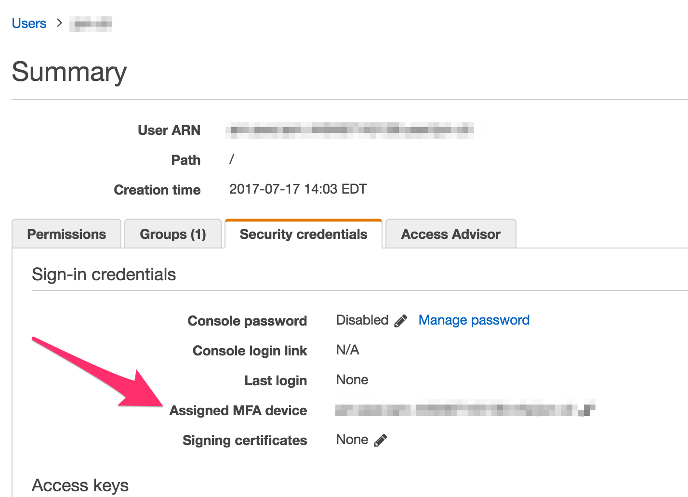

## AWS-MFA

Making MFA easier

First you should restrict MFA for your user (ideally your group) by adding the following to the actions your cli user is authorized to

```json
"Condition":
{
    "Null":{"aws:MultiFactorAuthAge":"false"}
}
```

Then you should add an MFA to your user and take note of you MFA ARN. (I have been using Google Authenticator as my virtual device). 

 

Install `simple-aws-mfa`
    
    npm install -g simple-aws-mfa

then execute the following

    eval $(simple-aws-mfa <mfa-arn> <token>)

this could be wrapped into a bash function

```sh
my-mfa-login(){
    eval $(npx simple-aws-mfa <mfa-arn> $1)
}
```

and called without the mfa-arn

    my-mfa-login <token>   

or if you have multiple aws accounts

```sh
aws-account1(){
    unset AWS_SESSION_TOKEN
    export AWS_SECRET_ACCESS_KEY="..."
    export AWS_ACCESS_KEY_ID="..."
    eval $(simple-aws-mfa <mfa-arn-1> $1)
}

aws-account2(){
    unset AWS_SESSION_TOKEN
    export AWS_SECRET_ACCESS_KEY="..."
    export AWS_ACCESS_KEY_ID="..."
    eval $(simple-aws-mfa <mfa-arn-2> $1)
}
```

Note that after logging in, your `AWS_SECRET_ACCESS_KEY` and `AWS_ACCESS_KEY_ID` will be stomped on by the STS values from your MFA. So you should close your bash session and create a new one to start from scratch. Or you can use the bash functions described above which reset the values for you.  
